# 🤖 Cloudflare Worker Telegram Bot Gateway

A scalable, high-performance Telegram Bot Gateway hosted on **Cloudflare Workers**. This project serves as a central "Traffic Controller" that routes user commands to different backend logic workers (Microservices) using **Cloudflare Service Bindings**.


## 🚀 Architecture

Instead of putting all logic into one massive file, this architecture splits features into separate workers.

```mermaid
graph LR
    User["📱 Telegram User"] -->|Command| TG["Telegram API"]
    TG -->|Webhook| Gateway["🤖 Main Gateway"]
    
    subgraph Cloudflare ["☁️ Cloudflare Internal Network"]
        direction LR
        Gateway -->|Binding| W1["🎰 2D Worker"]
        Gateway -->|Binding| W2["🎲 3D Worker"]
        Gateway -->|Binding| W3["📊 Report Worker"]
        Gateway -->|Binding| W4["🎮 Other Workers"]
    end
    
    W1 -.->|Reply| TG
    W2 -.->|Reply| TG
    W3 -.->|Reply| TG


```



## ✨ Features

* **Microservices Architecture:** Add, remove, or update specific features (e.g., 2D Logic) without touching the Main Gateway.
* **Ultra-Low Latency:** Uses **Service Bindings** (RPC) to communicate between workers, avoiding public internet latency.
* **Smart Routing:** Automatically strips commands (e.g., converts `/2d 12-500` -> `12-500`) before forwarding data to backend workers.
* **Scalable:** Easily expandable to 5, 10, or 50+ backend bots under a single Telegram Bot Token.
* **Cost Effective:** Runs on Cloudflare Workers (Free Tier friendly).

## 🛠️ Installation & Setup

### Prerequisite

* A Cloudflare Account.
* A Telegram Bot Token (from @BotFather).

### Step 1: Deploy Backend Workers

Create separate Cloudflare Workers for your logic (e.g., `2DCalcPro.js`, `3DCalcPro.js`).

1. Create a worker (e.g., `backend-2d-pro`).
2. Paste your logic code.
3. Add `TELEGRAM_BOT_TOKEN` to the worker's Environment Variables.
4. **Note:** Do NOT set a webhook for these workers.

### Step 2: Deploy Main Gateway

1. Create a new Worker (e.g., `main-gateway`).
2. Copy the code from `gateway.js` (or `a.js`) in this repo.
3. Deploy the worker.

### Step 3: Configure Bindings (Crucial)

Go to your **Main Gateway Worker** > **Settings** > **Bindings**.
Add the following **Service Bindings**:

| Variable Name | Service (Worker Name) | Description |
| --- | --- | --- |
| `BOT_2D` | `backend-2d-pro` | Connects to 2D Logic |
| `BOT_3D` | `backend-3d-pro` | Connects to 3D Logic |
| `BOT_REPORT` | `backend-thai-lottery` | Connects to Report Logic |

*(Note: Variable names must match exactly with the code).*

### Step 4: Environment Variables

Go to **Main Gateway Worker** > **Settings** > **Variables**.

| Variable Name | Value |
| --- | --- |
| `BOT_TOKEN` | `YOUR_TELEGRAM_BOT_TOKEN` |

### Step 5: Set Webhook

Finally, tell Telegram to send messages to your Main Gateway. Open your browser and run:

```
[https://api.telegram.org/bot](https://api.telegram.org/bot)<YOUR_TOKEN>/setWebhook?url=https://<YOUR_GATEWAY_URL>.workers.dev

```

## 🎮 Usage Guide

Users can interact with the bot via Menu or Commands:

* **/start** : Displays the main menu.
* **/2d [list]** : Calculates 2D inputs.
* **/3d [list]** : Calculates 3D inputs.
* **/r [list]** : Generates lottery reports.

**Example Input:**

```text
/2d
12 - 500
34 - 1000

```

## 📂 Project Structure

```
├── gateway.js        # Main Gateway Logic (The Traffic Police)
├── workers/
│   ├── 2DCalcPro.js  # Backend Logic for 2D
│   ├── 3DCalcPro.js  # Backend Logic for 3D
│   └── Report.js     # Backend Logic for Reporting
└── README.md         # Documentation

```

## 🤝 Contributing

1. Fork the Project
2. Create your Feature Branch
3. Commit your Changes
4. Push to the Branch
5. Open a Pull Request

## ⚠️ Disclaimer

This project is for educational purposes only. The developer is not responsible for any misuse of this source code for gambling or illegal activities.

---

**Developed with ❤️ using Cloudflare Workers**

```

